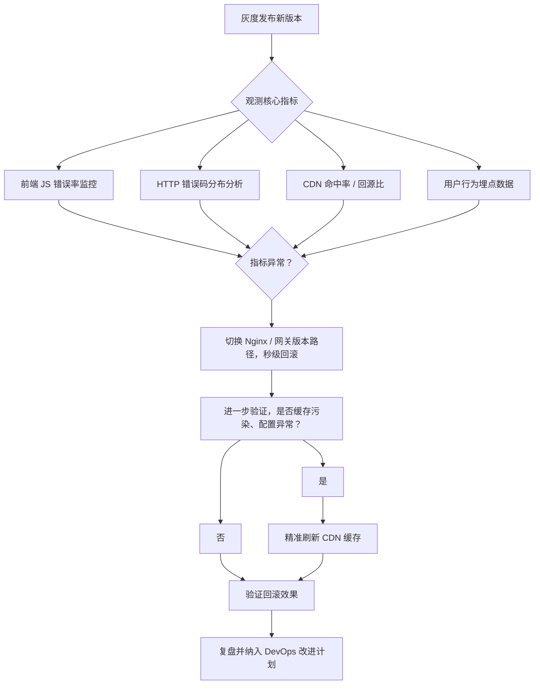

本文提供了一套覆盖静态资源管理、缓存策略、灰度发布、秒级回滚到 DevOps 闭环改进的完整方案，可作为前端交付流程标准化的参考实现。

## 前端资源缓存层级

* **浏览器缓存**：客户端本地缓存，通过响应头（如 Cache-Control）控制，优先命中，减少网络请求次数和延迟
* **CDN 缓存**：分布式边缘节点缓存，靠近用户，降低跨地域访问延迟，减轻源站回源压力
* **中间代理缓存**：企业或运营商网络内的代理缓存服务器，缓存常用资源，提升网络传输效率，节省带宽
* **源站缓存**：服务器端缓存机制，减少后端计算和数据库访问压力，提升源站响应性能

> 本文重点关注浏览器缓存和 CDN 缓存。

## 静态资源分类

| 分类                 | 内容示例           |
| -------------------- | ------------------ |
| 核心业务代码         | JS、CSS 主入口     |
| 公共库 / 组件        | 框架包、UI 库      |
| 图片、字体等静态资产 | png、jpg、woff2 等 |
| 配置文件             | 前端动态配置 json  |
| 离线静态资源         | PWA 静态资源缓存   |

## Cache-Control 策略

### 常用指令

* public：响应可被任何缓存区缓存，包括浏览器和中间代理（CDN、代理服务器），适用于无敏感信息且可共享的资源
* private：响应仅允许浏览器私有缓存，禁止共享缓存，适用于包含用户隐私或个性化内容的资源
* no-cache：缓存必须先向服务器验证有效性（协商缓存），不能直接使用缓存响应，可保证内容实时性
* no-store：完全禁止缓存，客户端和中间缓存都不会存储响应，适用于高安全性或动态频繁变化的数据
* max-age：缓存资源的最大有效时间（秒）
* immutable：资源在有效期内不变，浏览器不会发起重新验证请求，适合带内容哈希的静态资源

示例：

```http
Cache-Control: public, max-age=31536000, immutable
```

### 使用场景

针对不同资源，合理配置 Cache-Control 可以有效提升资源加载性能并降低回源压力。

| 资源类型                | 推荐 Cache-Control                  | 适用场景说明                                            |
| ----------------------- | ----------------------------------- | ------------------------------------------------------- |
| 含内容哈希的静态资源    | public, max-age=31536000, immutable | JS、CSS、图片、字体等静态文件，内容哈希变更触发缓存失效 |
| 动态配置文件 / 接口数据 | no-cache 或 max-age=60              | 配置 JSON、接口响应等频繁变更的动态数据                 |
| 短期缓存场景            | max-age=60 或 max-age=0`            | 频繁变更的小文件、临时资源                              |
| HTML 页面               | no-cache 或 no-store                | 高安全场景建议使用 no-store 防止逻辑异常                |

## 内容哈希与版本目录管理

静态资源文件名中嵌入内容哈希，示例：

```bash
app.4f3d2b.js
style.f91a7c.css
logo.2ac89f.png
```

版本目录路径可以实现更细粒度管理，示例：

```bash
/cdn/prod/20250617_4f3d2b/app.js
/cdn/prod/20250617_4f3d2b/style.css
```

推荐使用版本目录 + 内容哈希文件名双保险，支持秒级灰度和回滚，无需刷新 CDN。

## 资源加载性能调优

* 开启 HTTP2 和压缩算法
* 静态资源配置长缓存，减少回源压力
* 动态接口或 API 设置短缓存或禁止缓存，保证数据实时

以下是一个 Nginx 配置示例：

```nginx
server {
    listen 443 ssl http2;
    server_name cdn.your.com;

    ssl_certificate /path/to/cert.pem;
    ssl_certificate_key /path/to/key.pem;

    root /data/cdn;

    # 可替换成 brotli 压缩，HTTPS 下优于 gzip
    gzip on;                                                               
    gzip_types text/css application/javascript application/json;
    gzip_comp_level 5;

    # 静态资源长缓存
    location ~* \.(js|css|png|jpg|woff2)$ {
        add_header Cache-Control "public, max-age=31536000, immutable";
    }

    # 动态配置短缓存
    location ~* \.(json)$ {
        add_header Cache-Control "no-cache";
    }

    # 页面禁止缓存
    location / {
        try_files $uri $uri/ /index.html;
        add_header Cache-Control "no-store";
    }

    # API 短缓存
    location /api/ {
        proxy_pass http://backend;
        proxy_cache my_cache;
        proxy_cache_valid 200 1m;
    }
}
```

## Service Worker 缓存策略

PWA 应用支持通过 Service Worker 可实现离线缓存与前端层缓存加速。

| 策略模式                   | 适用场景                  | 特点说明                               |
| -------------------------- | ------------------------- | -------------------------------------- |
| **Cache First**            | 静态资源（JS/CSS/图片等） | 优先缓存，减少请求，提升离线体验       |
| **Network First**          | 动态接口、实时配置文件    | 优先网络，失败兜底缓存，保证数据实时性 |
| **Stale While Revalidate** | 静态 + 动态混合内容       | 先返回缓存，后台更新，兼顾速度与新鲜度 |

## 缓存回滚与恢复策略

### 预先设计分流策略

发布新版本时，先针对部分流量（按流量比例或用户组）进行灰度发布，在请求 header、cookie 或 query 参数进行流量标识，例如 `X-Version: v1.0.0`，配合代理网关或 CDN 定向流量，定义观测指标。

* 前端 JS 错误率（接入 Sentry、监控埋点）
* HTTP 状态码分布（5xx、4xx 占比）
* CDN 命中率、回源比
* 平均响应时间
* 用户行为回退率 / 页面崩溃率

### 实现版本路径化管理

确保前端资源、接口路径已实现严格版本化，如：

```bash
/static/v1.0.0/xxx.js
/api/v1.0.0/xxx
```

示例：

```nginx
location /static/ {
    alias /data/app/static/$version/;
}
```

📌注：PWA 应用需要确保 Service Worker 缓存清单与版本目录一致，必要时支持调用强制 reload()，或引导用户清理缓存。

### 回滚操作流程

这里给出流程图供参考：



实际回滚操作流程大致如下：

1. 监测到指标异常告警。
1. 立即切 Nginx 配置版本路径（`/v1.0.0` -> `/v0.9.9`），并进行验证。
1. 判断是否还需要精准刷新 CDN 缓存。
   * 若版本路径已变，CDN 无污染，无需刷新
   * 若出现缓存污染或出现配置异常，调用 CDN 精准刷新 API，必要时执行目录级刷新
1. 监控验证回滚效果：通过前端 JS 错误率、CDN 命中率、回源流量等实时数据，验证切换是否生效。
1. 复盘与改进：记录本次回滚操作时间线、耗时、影响面，分析根原，制定改进计划（如缓存策略优化、引入发布校验、CDN 刷新接入 CI 流程），形成 DevOps 良心循环
